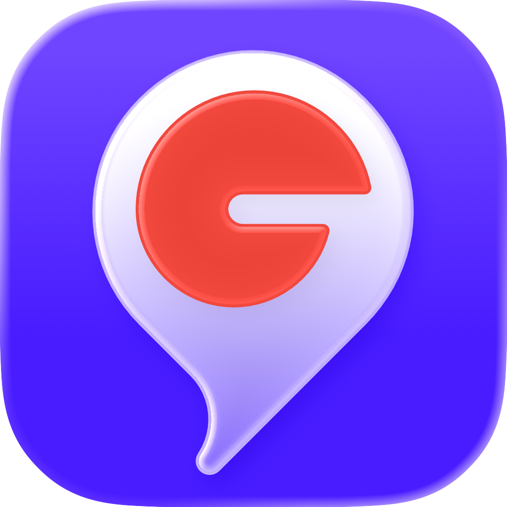
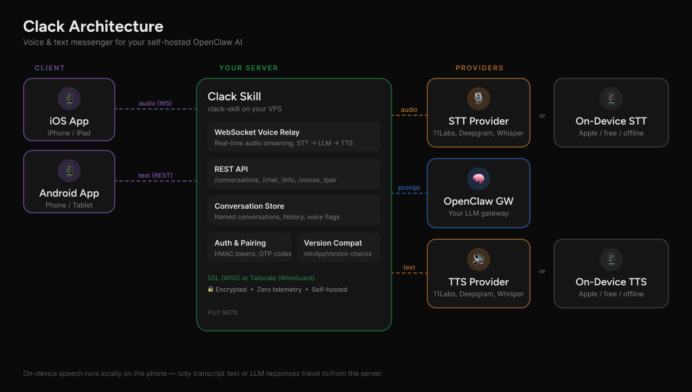

# Clack — AI Messenger for OpenClaw



[](mailto:hello@clack-app.com)

[](https://clawhub.ai/fbn3799/clack)
[](https://clawhub.ai/fbn3799/clack)

> Voice & text messenger for your self-hosted OpenClaw AI. Real-time, private, fully under your control.

Clack is an [OpenClaw](https://github.com/openclaw/openclaw) skill that turns your AI into a private messenger. Chat by text or talk by voice — across multiple conversations, all stored on your own server.

📱 **Available on [iOS](https://apps.apple.com/app/clack-hands-free-voice-agent/id6759464908) and [Android](https://play.google.com/store/apps/details?id=net.fabianschneider.apps.clack)!** The [server/skill is open source](https://github.com/fbn3799/clack-skill) — feel free to build your own client!

## Quickstart

Just tell your OpenClaw agent:

```
Install the Clack messenger skill from https://github.com/fbn3799/clack-skill and set it up
```

Your agent will clone the repo, run the setup script, and configure everything. That's it.

## Features

- 💬 **Text chat** with streaming responses in every conversation
- 🎙️ **Real-time voice calls** with your OpenClaw agent
- 📋 **Multiple conversations** — create, rename, and switch between chats
- 🔊 **Independent voice providers**: Choose STT and TTS separately — ElevenLabs, OpenAI, Deepgram, or on-device
- 💰 **Cost-saving combos**: Free on-device transcription + premium cloud voices, or fully local for zero API spend
- 📱 **On-device speech**: Apple speech frameworks for STT and/or TTS — works offline, no API keys needed
- 🗣️ **20+ built-in voices** with easy aliases
- 🧠 **Conversation history**: Persisted on your server across sessions
- 🏷️ **Voice/text indicators**: See which messages were spoken vs typed
- 🔒 **Encrypted connections**: Domain with SSL or Tailscale — no unencrypted public access
- 🔐 **Secure pairing**: Rate-limited one-time codes with 5-minute expiry
- 🏠 **Self-hosted**: Your server, your providers, your data
- ⚡ **Version compatibility**: Bidirectional checks prevent mismatched app/server versions

## How It Works



On-device speech (Apple STT/TTS) runs locally on the phone — only transcript text or LLM responses travel to/from the server.

## Quick Start

### 1. Install & set up

```bash
git clone https://github.com/fbn3799/clack-skill.git ~/.openclaw/skills/clack
sudo bash ~/.openclaw/skills/clack/scripts/setup.sh
```

This clones the repo and runs the interactive setup.

The interactive setup will:
- Install system dependencies (Python, venv)
- Auto-detect your OpenClaw gateway config
- Enable the `/v1/chat/completions` endpoint if needed
- Prompt for API keys (ElevenLabs, OpenAI, Deepgram — all optional)
- Ask you to choose Domain (SSL) or Tailscale connection mode
- Generate a `RELAY_AUTH_TOKEN` and configure a systemd service
- Print exactly what to enter in the app

> **No API keys?** No problem — on-device STT/TTS works without any speech provider keys.

### 2. Connect securely

All connections are encrypted. The setup script will ask you to choose:

**Option A: Domain with SSL (recommended for remote servers)**

Requires a DNS A record pointing to your server. Setup auto-configures SSL via Caddy. Works with free [DuckDNS](https://www.duckdns.org) domains too.

After setup, **pair the app**: the setup script prints a 6-character pairing code. Enter it in the app under Settings → Server → Pair with Server. Codes expire after 5 minutes — generate new ones with `clack pair`.

**Option B: Tailscale (simplest for personal use)**

Install Tailscale on your server and phone. Use the server's Tailscale IP (e.g. `100.x.x.x`) in the app. **No pairing needed** — Tailscale connections are trusted automatically.

**Firewall port 9878** from the public internet — only allow localhost and Tailscale access.

### 3. Open the app and connect

1. Open the Clack app ([clack-app.com](https://clack-app.com))
2. Go to Settings → Server
3. Enter your domain or Tailscale IP
4. **Domain mode**: Tap "Pair with Server" and enter the code from setup
5. **Tailscale mode**: Just connect — no pairing required
6. Start chatting — by voice or text!

## Configuration

Service configuration is via environment variables (set in the systemd service file). Provider API keys are stored separately in `config.json` (created by the setup script).

| Variable | Default | Description |
|----------|---------|-------------|
| `RELAY_AUTH_TOKEN` | — | **Required.** Auth token for all protected endpoints |
| `OPENCLAW_GATEWAY_URL` | `http://127.0.0.1:18789` | OpenClaw Gateway URL |
| `OPENCLAW_GATEWAY_TOKEN` | — | Gateway bearer token |
| `STT_PROVIDER` | `elevenlabs` | `elevenlabs`, `openai`, or `deepgram` |
| `TTS_PROVIDER` | `elevenlabs` | `elevenlabs`, `openai`, or `deepgram` |
| `TTS_VOICE` | `Will` | Default voice (name or ID) |
| `VOICE_RELAY_PORT` | `9878` | Server port |
| `CLACK_MAX_INPUT_CHARS` | `300` | Max transcript length |
| `CLACK_HISTORY_DIR` | `/var/lib/clack/history` | History storage path |
| `CLACK_MAX_HISTORY` | `50` | Max conversation history messages |
| `CLACK_AGENT_NAME` | — | Agent name shown in the client app |

Provider API keys (`ELEVENLABS_API_KEY`, `OPENAI_API_KEY`, `DEEPGRAM_API_KEY`) are stored in `config.json` with restricted file permissions. The setup script manages these — re-run `clack setup` to add, update, or remove keys.

> **Tip:** For local speech mode (on-device STT/TTS), you don't need any speech API keys — only the OpenClaw gateway connection.

## API Endpoints

### REST

| Method | Endpoint | Description |
|--------|----------|-------------|
| `GET` | `/health` | Health check (no auth) |
| `POST` | `/pair` | Pair a device with a one-time code (no auth) |
| `GET` | `/info` | Server info, providers, version compatibility |
| `GET` | `/conversations` | List all conversations |
| `POST` | `/conversations` | Create a new conversation |
| `DELETE` | `/conversations/{id}` | Delete a conversation |
| `GET` | `/conversations/{id}/history` | Get conversation message history |
| `PUT` | `/conversations/{id}/rename` | Rename a conversation |
| `POST` | `/chat` | Send a text message, get a streamed response |
| `GET` | `/voices` | List available TTS voices |

### WebSocket

| Endpoint | Description |
|----------|-------------|
| `WS /ws` | Voice session — streams audio bidirectionally |

Messages in conversation history include an optional `voice: true` flag to distinguish voice-originated messages from text.

## Version Compatibility

The app and server perform bidirectional version checks on connect:

| Check | Where | What happens |
|-------|-------|-------------|
| App too old | Server returns `minAppVersion` in `/info` | App shows "Update Required" with App Store link |
| Server too old | App checks `serverVersion` from `/info` | App shows "Server Update Required" alert |

When adding features that require both sides to update, bump the relevant minimum version **after** the new version is deployed/released.

## Security

- **Encrypted connections only**: Domain with SSL (WSS) or Tailscale (WireGuard) — the app does not support unencrypted public connections
- **Port 9878 should be firewalled**: Only allow access via localhost (for Caddy) and Tailscale
- **Auth token** required for all endpoints except `GET /health` and `POST /pair`
- **Pairing is rate-limited**: 5 attempts per IP per 5 minutes, 2s delay on failure
- **One-time codes**: 6-character alphanumeric, expire after 5 minutes, single-use
- **Constant-time** token verification (HMAC) to prevent timing attacks
- **Input sanitization**: User context is stripped to natural-language characters only, with IP addresses and domains removed
- **No telemetry**: Zero analytics, tracking, or data sent to developers
- **Voice audio** goes to your server and only to the providers you choose

## Mix and Match Voice Providers

Choose providers per direction in **Settings → Voice**:

| STT | TTS | Trade-off |
|-----|-----|-----------|
| Cloud (ElevenLabs) | Cloud (ElevenLabs) | Best quality, highest cost |
| On-device | Cloud (ElevenLabs) | Free transcription + premium voices |
| On-device | On-device | Zero API spend, works offline* |
| Cloud (OpenAI) | Cloud (Deepgram) | Mix providers freely |

*Offline except for the LLM call to your OpenClaw gateway.

## Server Management

```bash
clack status     # Check service status
clack restart    # Restart the server
clack logs       # Tail logs
clack pair       # Generate a new pairing code
clack update     # Pull latest code and restart
clack setup      # Re-run interactive setup
clack uninstall  # Remove service and venv
```

## Troubleshooting

| Problem | Solution |
|---------|----------|
| Connection refused | Check port 9878 is open in your firewall |
| `auth_failed` on WebSocket | Verify `RELAY_AUTH_TOKEN` matches between server and app |
| No audio response | Check your STT/TTS provider API key is valid |
| Pairing code rejected | Codes expire after 5 min — generate a fresh one |
| HTTP 429 on pairing | Rate limit hit — wait 5 minutes and try again |
| Echo/feedback loop | This is auto-detected; if persistent, check mic/speaker distance |
| High latency | Try a different STT/TTS provider, or use local speech mode |
| "Server Update Required" | Run `clack update` on your server |

## Documentation

See [SKILL.md](SKILL.md) for full protocol docs, WebSocket message reference, and endpoint details.

See [CHANGELOG.md](CHANGELOG.md) for version history.

See [ClawHub](https://clawhub.ai/fbn3799/clack) for security ratings and reviews.

## License

MIT
