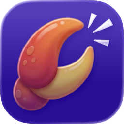

# Clack — Voice Relay for OpenClaw

<p align="center">
  
</p>

[](https://clawhub.ai/fbn3799/clack)

> Talk to your AI assistant by voice. Real-time, self-hosted, private.

Clack is an [OpenClaw](https://github.com/openclaw/openclaw) skill that sets up a WebSocket voice relay server. It bridges voice input through speech-to-text → your OpenClaw agent → text-to-speech, enabling natural voice conversations.

📱 **[Apps available soon for iOS and Android!](https://clack-app.com)**

## Quickstart

Just tell your OpenClaw agent:

```
Install the Clack voice relay skill from https://github.com/fbn3799/clack-skill and set it up
```

Your agent will clone the repo, run the setup script, and configure everything. That's it.

## Features

- 🎙️ **Real-time voice chat** with your OpenClaw agent
- 🔊 **Independent voice input/output**: Choose STT and TTS providers separately — ElevenLabs, OpenAI, Deepgram, or on-device
- 💰 **Cost-saving combos**: Free on-device transcription + premium cloud voices, or fully local for zero API spend
- 📱 **On-device speech**: Apple speech frameworks for STT and/or TTS — works offline, no API keys needed
- 🗣️ **20 built-in ElevenLabs voices** with easy aliases
- 🧠 **Conversation memory**: Persisted across calls (up to 50 messages)
- 🔒 **Encrypted connections**: Domain with SSL or Tailscale — no unencrypted public access
- 🔐 **Secure pairing**: Rate-limited one-time codes with 5-minute expiry
- 🏠 **Self-hosted**: Your server, your providers, your data
- 🎯 **Session isolation**: Each call gets its own `clack:<uuid>` session
- ⚡ **Interrupt support**: Cancel TTS mid-sentence for natural conversation
- 🔇 **Echo test mode**: Test your audio pipeline without using LLM credits

## Quick Start

### 1. Install & set up

```bash
curl -fsSL https://raw.githubusercontent.com/fbn3799/clack-skill/master/scripts/install.sh | sudo bash
```

This single command clones the repo, installs dependencies, and runs the interactive setup.

The interactive setup will:
- Install system dependencies (Python, venv)
- Auto-detect your OpenClaw gateway config
- Enable the `/v1/chat/completions` endpoint if needed
- Prompt for API keys (ElevenLabs, OpenAI, Deepgram — all optional)
- Ask you to choose Domain (SSL) or Tailscale connection mode
- Generate a `RELAY_AUTH_TOKEN` and configure a systemd service
- Print exactly what to enter in the app

> **No API keys?** No problem — on-device STT/TTS works without any speech provider keys.

### 4. Connect securely

All connections are encrypted. The setup script will ask you to choose:

**Option A: Domain with SSL (recommended for remote servers)**

Requires a DNS A record pointing to your server. Setup auto-configures SSL via Caddy. Works with free [DuckDNS](https://www.duckdns.org) domains too.

After setup, **pair the app**: the setup script prints a 6-character pairing code. Enter it in the app under Settings → Server → Pair with Server. Codes expire after 5 minutes — generate new ones with `clack pair`.

**Option B: Tailscale (simplest for personal use)**

Install Tailscale on your server and phone. Use the server's Tailscale IP (e.g. `100.x.x.x`) in the app. **No pairing needed** — Tailscale connections are trusted automatically.

**Firewall port 9878** from the public internet — only allow localhost and Tailscale access.

### 5. Open the app and connect

1. Open the Clack iOS app ([App Store](https://clack-app.com) or build from source)
2. Go to Settings → Server
3. Enter your domain or Tailscale IP
4. **Domain mode**: Tap "Pair with Server" and enter the code from setup
5. **Tailscale mode**: Just connect — no pairing required
6. Tap the microphone and start talking!

## Configuration

All configuration is via environment variables (set in your systemd service or `.env` file):

| Variable | Default | Description |
|----------|---------|-------------|
| `RELAY_AUTH_TOKEN` | — | **Required.** Auth token for all protected endpoints |
| `OPENCLAW_GATEWAY_URL` | `http://127.0.0.1:18789` | OpenClaw Gateway URL |
| `OPENCLAW_GATEWAY_TOKEN` | — | Gateway bearer token |
| `STT_PROVIDER` | `elevenlabs` | `elevenlabs`, `openai`, or `deepgram` |
| `TTS_PROVIDER` | `elevenlabs` | `elevenlabs`, `openai`, or `deepgram` |
| `TTS_VOICE` | `Will` | Default voice (name or ID) |
| `ELEVENLABS_API_KEY` | — | ElevenLabs API key |
| `OPENAI_API_KEY` | — | OpenAI API key |
| `DEEPGRAM_API_KEY` | — | Deepgram API key |
| `VOICE_RELAY_PORT` | `9878` | Server port |
| `CLACK_ECHO_MODE` | `false` | Enable echo test mode server-wide |
| `CLACK_MAX_INPUT_CHARS` | `300` | Max transcript length |
| `CLACK_HISTORY_DIR` | `/var/lib/clack/history` | History storage path |
| `CLACK_MAX_HISTORY` | `50` | Max conversation history messages |

> **Tip:** For local speech mode (on-device STT/TTS), you don't need any speech API keys — only the OpenClaw gateway connection.

## Security

- **Encrypted connections only**: Domain with SSL (WSS) or Tailscale (WireGuard) — the app does not support unencrypted public connections
- **Port 9878 should be firewalled**: Only allow access via localhost (for Caddy) and Tailscale
- **Auth token** required for all endpoints except `GET /health` and `POST /pair`
- **Pairing is rate-limited**: 5 attempts per IP per 5 minutes, 2s delay on failure
- **One-time codes**: 6-character alphanumeric, expire after 5 minutes, single-use
- **Constant-time** token verification (HMAC) to prevent timing attacks
- **No telemetry**: Zero analytics, tracking, or data sent to developers
- **Voice audio** goes to your server and only to the providers you choose
- The iOS app stores only local settings (server address, token, preferences)

## How It Works

STT and TTS are independently configurable — pick any combination of on-device and cloud providers per call.

### Cloud mode (default)

```
📱 Clack App          🖥️ Your Server          🌐 APIs
┌──────────┐  audio   ┌──────────────┐         ┌─────────────┐
│ 🎙️ Mic   ├─────────►│ Clack Relay  ├────────►│ STT Provider│
│          │           │              │◄────────┤ (transcript)│
│          │           │              │         ├─────────────┤
│          │           │              ├────────►│ OpenClaw GW │
│          │  audio    │              │◄────────┤ (AI reply)  │
│ 🔊 Speaker│◄─────────┤              ├────────►├─────────────┤
│          │           │              │◄────────┤ TTS Provider│
└──────────┘           └──────────────┘         └─────────────┘
```

### On-device STT + cloud TTS (cost saver)

```
📱 Clack App                    🖥️ Your Server          🌐 APIs
┌──────────────┐                ┌──────────────┐         ┌─────────────┐
│ 🎙️ Mic        │                │              │         │             │
│ ↓ Apple STT  │  text          │ Clack Relay  ├────────►│ OpenClaw GW │
│ "Hey, what…" ├───────────────►│              │◄────────┤ (AI reply)  │
│              │  audio          │              ├────────►├─────────────┤
│ 🔊 Speaker    │◄───────────────┤              │◄────────┤ TTS Provider│
└──────────────┘                └──────────────┘         └─────────────┘
```
STT happens on-device (free, unlimited) — only the transcript text is sent to the server. Great for saving transcription API costs while keeping premium cloud voices.

### Fully on-device (zero API spend)

```
📱 Clack App                    🖥️ Your Server
┌──────────────┐                ┌──────────────┐
│ 🎙️ Mic        │                │              │
│ ↓ Apple STT  │  text          │ Clack Relay  ├────────► OpenClaw GW
│ "Hey, what…" ├───────────────►│              │◄────────  (AI reply)
│              │  text           │              │
│ Apple TTS ↓  │◄───────────────┤              │
│ 🔊 Speaker    │                │              │
└──────────────┘                └──────────────┘
```
Both STT and TTS run on-device using Apple speech frameworks. The server only handles LLM routing — no speech API keys needed at all. Works offline (except for the LLM call).

### Mix and match

Choose providers per direction in **Settings → Voice**:

| STT | TTS | Trade-off |
|-----|-----|-----------|
| Cloud (ElevenLabs) | Cloud (ElevenLabs) | Best quality, highest cost |
| On-device | Cloud (ElevenLabs) | Free transcription + premium voices |
| On-device | On-device | Zero API spend, works offline* |
| Cloud (OpenAI) | Cloud (Deepgram) | Mix providers freely |

*Offline except for the LLM call to your OpenClaw gateway.

## Server Management

```bash
clack status     # Check service status
clack restart    # Restart the server
clack logs       # Tail logs
clack pair       # Generate a new pairing code
clack uninstall  # Remove service and venv
```

## Troubleshooting

| Problem | Solution |
|---------|----------|
| Connection refused | Check port 9878 is open in your firewall |
| `auth_failed` on WebSocket | Verify `RELAY_AUTH_TOKEN` matches between server and app |
| No audio response | Check your STT/TTS provider API key is valid |
| Pairing code rejected | Codes expire after 5 min — generate a fresh one |
| HTTP 429 on pairing | Rate limit hit — wait 5 minutes and try again |
| Echo/feedback loop | This is auto-detected; if persistent, check mic/speaker distance |
| High latency | Try a different STT/TTS provider, or use local speech mode |

## Documentation

See [SKILL.md](SKILL.md) for full protocol docs, WebSocket message reference, and endpoint details.

See [CHANGELOG.md](CHANGELOG.md) for version history.

## License

MIT
